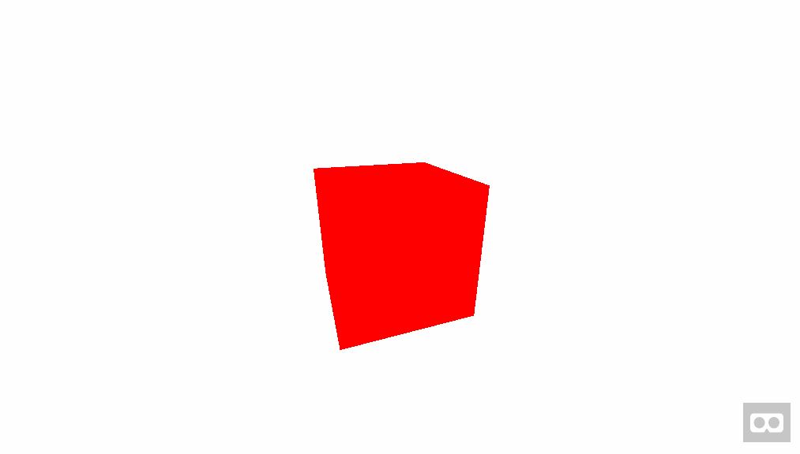

# An Introduction to
# <!-- fit --> **A-Frame**
---

# <!-- fit --> It's _**A Frame**work_
# <!-- fit --> for easily working
# <!-- fit --> with **WebGL and VR**

---

# <!-- fit --> Use **markup** to create<br>**VR experiences** that work<br>across **desktop**, **iOS**, **Android**, <br>and **VR Headsets**

---

# Entity: an _object_
## <!-- fit --> `<a-entity>`

---

# Common entities
## `<a-box>`, `<a-sphere>`, `<a-plane>`, `<a-obj-model>`
## **and many more...**

---

# Component: a _property_
## <!-- fit --> `<a-entity width="2">`

---
# Common components:

## `width`, `height`, `depth`, `radius`, `material`, `geometry`, `src`, `id`, `position`, `rotation`
## **and many more...**

---

# Creating a **red box**

```html
<a-scene>
  <a-box
    color="red"
  ></a-box>
</a-scene>
```

---

# <!-- fit --> ... that's it!

---


---

## <!-- fit --> Oh...there's a bit more

---

# Sizing
## You can either use<br>`width="2" height="2" depth="2"`<br>or the **geometry** component:<br>`geometry="width: 2; height: 2; depth: 2"`

---

# Scaling
## Specified in terms of **x**, **y** and **z** axis<br>`scale="1 1 1"`<br>Can use negative numbers to mirror an axis<br>`scale="-1 -1 1"`

---

# Positioning
## Starts from **0 0 0** in your scene<br>Specified in terms of **x**, **y** and **z** axis<br>`position="0 0 0"`

---

# Materials
## The appearance of an entity<br>Used to define **color**, **opacity**<br>**rendering effect** and texture **src**<br>`material="color: red; opacity: .5"`

---

# Lighting
## Cast light in your scene<br>**Types:** ambient, directional, <br>hemisphere, point, spot<br>Can also specify the color, intensity, angle

---

# Assets
## Used for preloading **textures**, <br>**sounds**, **videos**, and defining **mixins**

---

```html
<a-assets>
  
  <audio id="coin" src="coin.mp3"></audio>
  <video id="rick" src="nggyu.mp4"></video>
  <a-mixin id="massive" scale="10 10 10"></a-mixin>
</a-assets>
```

---

# Animating
## Specify the **attribute** to animate, the state to go **from** and **to**, the **dur**ation, of the animation, the **fill** mode, **repeat** count, **direction** and **easing** method.

---

```html
<a-entity ...>
  <a-animation
    attribute="rotation"
     dur="10000"
     fill="forwards"
     to="0 360 0"
     easing="linear"
     repeat="indefinite"
   ></a-animation>
</a-entity>
```

---



---

# <!-- fit -->Interaction<br>Interact with entities <br>through **clicking** or **gazing**

---

# <!-- fit --> Basically...<br>when you **look at stuff**<br>you can **make stuff happen**

---

# <!-- fit --> Read the A-Frame<br>docs for **cursor**

---

# <!-- fit --> Manipulating<br>things with **Javascript**

---

# Vanilla JavaScript

```javascript
.querySelector('a-image')
.getAttribute('opacity')
.setAttribute('material', 'color', 'red')
.addEventListener('collide')
.createElement('a-entity')
```

---


# With libraries...

```javascript
// jQuery
$('a-box').attr('width', 5);

// d3
d3.select('a-scene')
  .selectAll('a-box.bar')
  .data(data);
```

---

# <!-- fit --> If you hate writing <br>HTML-**esque** markup

---

# Use a **templating** language!

```javascript
// Jade/Pug example
a-scene(
  fog='type: linear; far: 20; color: #1a1a1a'
)
  a-entity(
    position='2 2.5 0'
    rotation='0 12 0'
  )
    each foo,index in locals.bar
      a-entity(
        position=(index * 1.4) + ' 0 ' + (index * -2)
        rotation='0 ' + (index * -15) + ' 0'
      )
```

---

# A short guide
# <!-- fit --> **blog.omgmog.net/gdd-aframe-guide**

---

# Boilerplate
# <!-- fit --> **github.com/aframevr/aframe-boilerplate**

---

# Official docs
# <!-- fit --> **aframe.io/docs/0.2.0/guide**

---

# More examples
# <!-- fit --> **aframe.io/aframe/examples**
